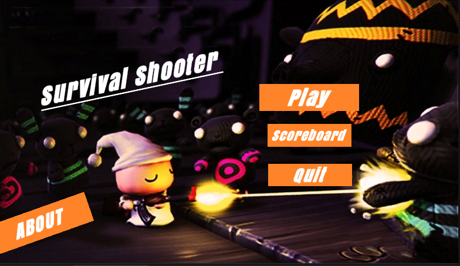
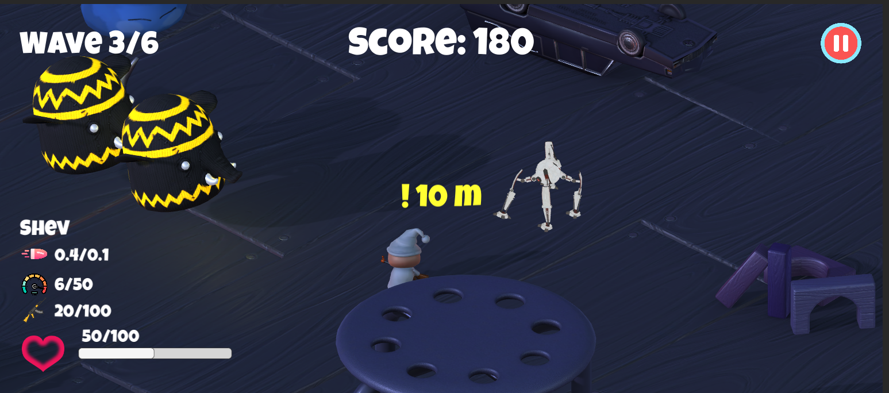
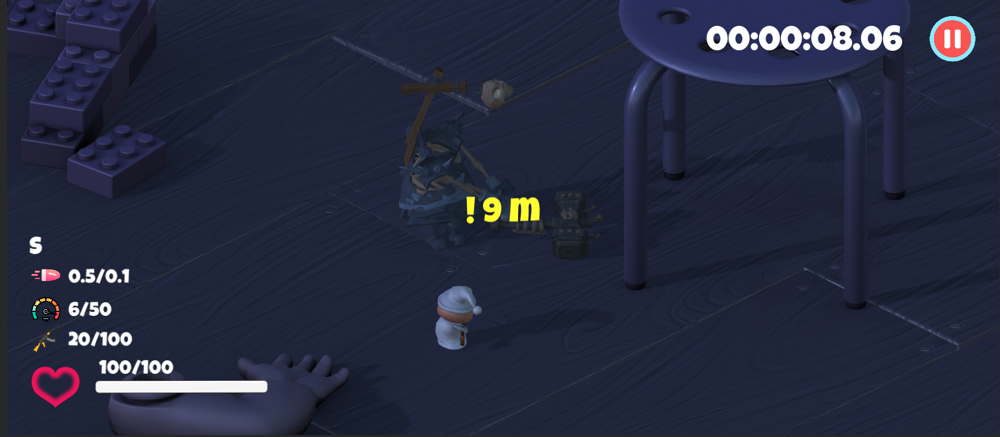
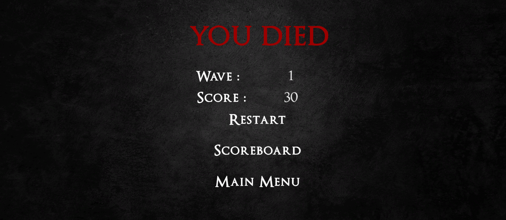
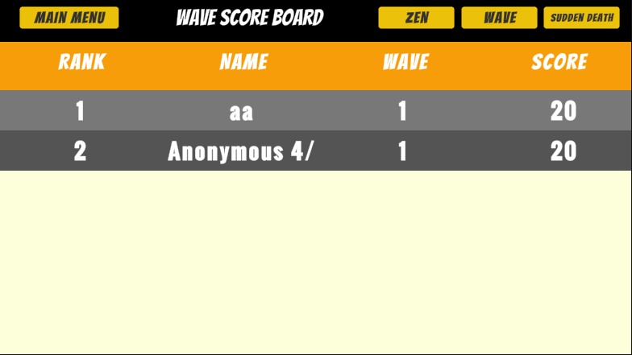

# Tugas Besar Unity IF3210 Platform-based Application Development Kelompok 22
> Survival Shooter : Extended
 
## Table of contents
  - [Deskripsi Aplikasi](#deskripsi-aplikasi)
  - [Cara Kerja](#cara-kerja)
  - [Cara Menjalankan Program](#cara-menjalankan-program)
  - [Library](#library)
  - [Screenshots](#screenshots)
  - [Pembagian Tugas](#pembagian-tugas)
  - [Credits](#credits)
  
## Deskripsi Aplikasi
 
Survival Shooter : Extended merupakan ekstensi dari permainan [Survival Shooter](https://learn.unity.com/tutorial/survival-shooter-training-day-phases?) yang diimplementasi menggunakan [Unity Game Engine](https://unity.com/), spesifiknya Unity3D.
## Cara Kerja
Cara kerja permainan secara umum mirip dengan cara kerja pembelajaran survival shooter yang disediakan unity. Namun terdapat berbagai perbedaan untuk memenuhi spesifikasi tugas besar. Berikut penjelasan untuk setiap spesifikasinya. 
 
### Atribut Player 
Atribut yang ditampilkan pada permianan terkait player adalah 
Kecepatan antar peluru dapat dikeluarkan 
Kekuatan peluru / damagePerShot 
Health
Speed 
Atribut dituliskan dengan format “currenValue/maxValue”. Untuk semua atribut dijadikan public static pada kelas Player yang ditulis pada player.cs. 
 
Kecepatan antar peluru (time between bullets) nilainya diatur pada bagian update di PlayerShooting.cs begitu juga dengan kecepatan peluru. Untuk perubahan nilai health diatur pada update di PlayerHealth.cs dan Speed diatur nilainya pada PlayerMovement.cs Untuk tampilannya menggunakan icon dan text
 
### Orb
Terdapat tiga macam orb yaitu red orb, yellow orb, dan green orb. Red orb memiliki efek penambahan Health Point (HP) pemain sebesar 25 point. Yellow Orb memiliki efek penambahan movement speed pemain sebesar 3 point. Green Orb memiliki efek penambahan damage per shoot pemain sebesar 10 point. Orb memiliki Orb factory untuk instantiate orb prefab dan Orb manager untuk spawn orb secara periodik dan random dengan spawn time nya selama setiap 12 detik. Selain itu, Orb juga memiliki maxOrbLife yang menandakan maksimum waktu orb tersebut berada pada map yaitu sebesar 8 detik.
 
### Additional Mobs
Berdasarkan spesifikasi, terdapat 3 Additional Mobs (selain mobs yang sudah ada pada base game) di antaranya :
 
#### Skeleton
Implementasi mob dengan tipe Skeleton memiliki trait yaitu tidak mampu bergerak, namun bisa menyerang dari jauh. Implementasi penyerangan jarak jauh menggunakan partikel Line Renderer (sama seperti player) dengan trajektori berwarna merah. Untuk pergerakan objek, Skeleton secara konstan akan menghadap (LookAt) ke arah pemain jika terdeteksi pada suatu range tertentu antara pemain dengan Skeleton, serta Skeleton akan mencoba menembak ke arah pemain. Selain itu, jika pemain Collide atau bertubrukan dengan Skeleton, pemain akan menerima damage sesuai dengan stat Melee Damage dari Skeleton.
 
Credits (3D Model) : [Squallete-Arbalete](https://sketchfab.com/3d-models/animated-lowpoly-crossbow-skeleton-f06287cbf2dc416e8ecb9a6a2bf06bd8)
##### Stats
- HP : 80
- Score : 20
- Weight : 4
- Speed : 0
- Melee Damage : 10
- Ranged Damage : 5
- Spawn : Random (Zen, Wave, Sudden Death)
 
#### Bomber
Implementasi mob dengan tipe Bomber (RobotBomber) memiliki trait yaitu memiliki speed 2x lipat mob lain, dan mampu meledakkan diri untuk memberi damage kepada pemain. Implementasi kemampuan meledakkan diri yaitu Bomber akan diberi timer (disini 5 detik) dari mulai spawn hingga meledakkan diri, secara otomatis meledakkan diri ketika sudah bertubrukan dengan pemain atau timer sudah habis. Untuk pergerakan objek, Bomber akan bergerak ke arah pemain hingga Bomber atau pemain mati.
 
Credits (3D Model) : [Robot-Animated](https://sketchfab.com/3d-models/robot-animated-17c0a508a6e84f6b8f777da1c79103a9)
##### Stats
- HP : 1
- Score : 15
- Weight : 3
- Speed : 7
- Melee Damage : 20
- Spawn : Static (Zen,Sudden Death), Random(Wave)
 
#### Boss
Implementasi mob dengan tipe Boss (AxeBoss) memiliki trait yaitu memiliki ukuran dan HP lebih besar dari mob lain. Untuk pergerakan objek, Boss akan bergerak ke arah pemain hingga Boss atau pemain mati, dan memiliki spinning attack / serangan berputar ketika sudah mendeteksi pemain pada suatu range tertentu antara Boss dan pemain. Pada Wave Mode, Boss di-spawn di wave terakhir (Wave 6).
 
Credits (3D Model) : [Boss](https://sketchfab.com/3d-models/boss-2233362e54b94af8bf51f8b1057f48c4)
##### Stats
- HP : 800
- Score : 200
- Weight : None
- Speed : 8
- Melee Damage : 40
- Spawn : Static (Zen,Sudden Death), Random(Wave)
 
#### Slime (tambahan)
Implementasi mob dengan tipe Slime memiliki trait yaitu mampu menembakkan 2 laser dari jarak jauh, juga mampu menyerang jarak dekat ketika bertubrukan dengan pemain. Untuk pergerakan objek, Slime akan bergerak ke arah pemain hingga Slime atau pemain mati, sambil menembakkan laser ke arah pemain jika terdeteksi pada attack range.Pada Wave Mode, Slime di-spawn di wave ke-3.
 
Credits (3D Model) : [Slime](https://sketchfab.com/3d-models/slime-f8df6013fe824d919eced0664eef160a)
##### Stats
- HP : 300
- Score : 80
- Weight : None
- Speed : 3.5
- Melee Damage : 30
- Ranged Damage : 5 per laser (x2)
- Spawn : Static (Zen,Sudden Death), Random(Wave)
 
 
### Game Mode 
 
#### Zen Mode 
Pada Zen Mode pemain diminta untuk bertahan selama mungkin dan enemy di spawn secara terus menerus sesuai interval spawn yang dimiliki tiap tipe enemy.\ 
Score pada Zen Mode merupakan waktu yang menyatakan berapa lama pemain dapat bertahan pada permainan (Survival Time). 
 
#### Wave Mode 
Pada Wave Mode pemain diminta untuk menyelesaikan setiap wave yang ada pada permainan dengan mengalahkan set dari Enemy yang muncul tiap Wave.

#### Sudden Death Mode (BONUS)
Mode ini mirip seperti Zen Mode, perbedaannya adalah pada Sudden Death Mode pemain hanya memiliki 1 kali kesempatan untuk terkena damage dari lawan. 
 
### Weapon Upgrade
Untuk upgrade weapon diatur pada WeaponUpgradeManager.cs. Terdapat tiga jenis upgrade weapon.
#### Upgrade Speed 
Upgrade speed disini yang dimaksud adalah dengan memperkecil waktu antar peluru dapat ditembakan dengan nilai awal 0.5 detik dan waktu tercepat adalah 0.1 detik 
#### Upgrade Diagonal
Upgrade diagonal yaitu dengan menambahkan dua peluru di kanan dan kiri dari tembakan sebelumnya, pada awalnya pemain hanya dapat menembakan 1 peluru dan maksimalnya pemain dapat menembak 5 peluru.

<b>BONUS</b>
#### Upgrade Power
Upgrade power yaitu menambahkan kekuatan tembakan (damagePerShot) senilai 20 , power pada senjata memiliki nilai maksimum 100.    
 
Penjelasan upgrade weapon pada Game Mode 
Zen Mode dan Sudden Death Mode 
Upgrade weapon pada mode game ini dilakukan setiap 1 menit pada detik ke 30 seperti 30, 1 menit 30, 2 menit 30. Untuk melakukan tersebut perlu adanya trigger untuk memanggil panel weapon upgrade. Hal tersebut dilakukan pada scoreManager.cs 
Wave Mode 
Pada wave Mode, upgrade weapon dilakukan setiap kali player menyelesaikan wave tersebut. Hal ini di trigger melalui EnemyWaveManager.cs
 
### Local Scoreboard
Terdapat tiga local scoreboard yaitu local scoreboard untuk zen mode, wave mode, dan sudden death mode. 
Local scoreboard Zen mode menampilkan rank, nama, dan waktu survival pemain. Diurutkan berdasarkan waktu survival pemain paling lama. 
Local scoreboard Wave mode menampilkan rank, nama, wave, dan score pemain. < … >
Local scoreboard Sudden Death mode menampilkan rank, nama, score, dan waktu survival pemain. Diurutkan berdasarkan score tertinggi kemudian waktu survival terlama.
Local scoreboard disimpan pada Playerprefs, sehingga scoreboard dapat dilihat kembali walaupun telah quit game. Penyimpanan scoreboard ke Playerprefs menggunakan library Newtonsoft json untuk serialize class c# ke json dan sebaliknya (untuk load data). 
 
### Main Menu
Pada awal game, pemain akan ditampilkan main menu yang berisi Play button, Scoreboard button, About button, dan Quit Button. Play Button akan menavigasikan pemain ke setting permainan yang berisi textfield untuk playername, pemilihan mode game (Zen mode, Wave mode, Sudden Death mode), Back button untuk kembali ke Main Menu, dan Next Button untuk memulai permainan. Scoreboard button akan menavigasikan pemain ke local scoreboard (secara default player akan dinavigasikan ke local scoreboard zen mode). About button akan menampilkan popup / modal yang berisikan penjelasan tentang game. Quit Button untuk quit dari game. 
 
### Game Over 
Ketika pemain berhasil menyelesaikan permainan (atau kalah), akan ditampilkan Game Over Screen/Scene yang akan menampilkan waktu survival (pada Zen Mode), Wave tertinggi dan score yang diraih (pada Wave Mode), atau waktu survival dan score yang diraih (pada Sudden Death Mode). Pada Screen ini juga ditampilkan 3 button untuk merestart permainan (dengan mode dan nama pemain yang sama), button ke halaman Scoreboard, dan button ke Main Menu.
 
## Cara Menjalankan Program
1. Pastikan Unity Sudah Terinstal
2. Untuk Menjalankan Program, dapat melalui 2 metode. 
   - Jika ingin menjalankan Program Lewat Unity Editor, drag Scene Menu ke Hierarchy, lalu play Scene.
   - Atau run .exe file (Survival-Shooter.exe) yang berada pada root directory
3. Untuk memainkan Zen Mode (atau mode permainan lainnya), dapat menekan tombol Play pada Main Menu, lalu klik terlebih dahulu button dari mode yang ingin dimainkan, kemudian klik tombol Next.
   
## Library
Newtonsoft json 
-> Digunakan untuk serialize class c# ke json dan deserialize json ke class c#. Serialize / deserialize ini digunakan untuk keperluan menyimpan data scoreboard pemain ke json. Kemudian, datanya disimpan ke playerprefs.
Sketchfab for unity
-> Digunakan untuk import 3d model ke unity agar lebih mudah daripada menggunakan web sketchfab
 
## Screenshots
### Main Menu

### Gameplay

### Boss Fight

### Game Over

### Scoreboard

## Pembagian Kerja Anggota Kelompok
| Nama     | NIM     | Pembagian kerja     |
| ------------- | ------------- | -------- |
| Mohammad Sheva Almeyda Sofjan    | 13519018         |Additional Mobs (Skeleton, Bomber, Boss, Slime), Zen Mode, Wave Mode |
| Muhammad Fikri N.          | 13519069        | Main Menu, ScoreBoard, Zen Mode, Sudden Death Mode, Orb, init Wave Mode  |
| Muhammad Tamiramin Hayat Suhendar | 13519129 | Initial Git, Attribute Player, Weapon Level up 
 
## Credits
- Unity Learn
- Sketchfab Content Creators
- Agate Academy